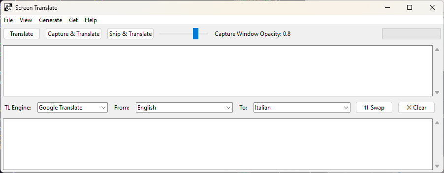
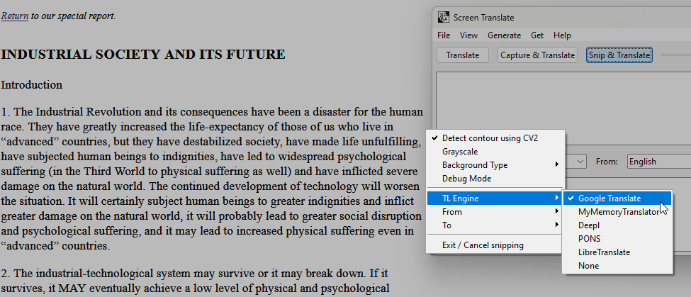
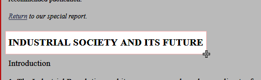
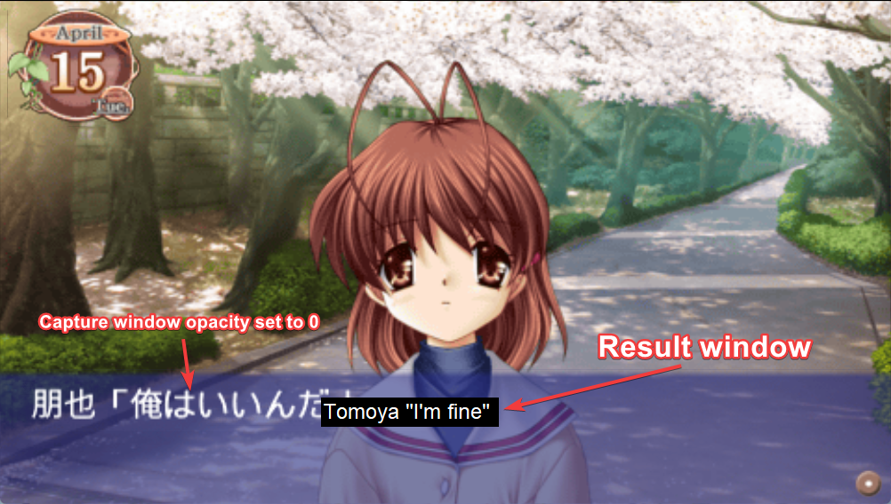
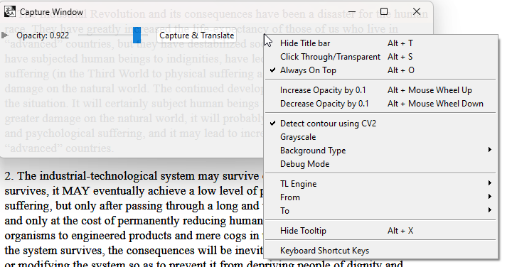
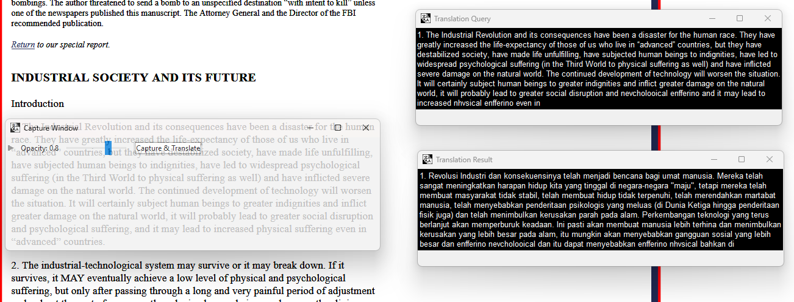

<p align="center">
    
</p>

<h1 align="center"> Screen Translate - An Easy to Use OCR Translator </h1>
<p align="center">
    <a href="https://github.com/Dadangdut33/Screen-Translate/issues"></a>
    <a href="https://github.com/Dadangdut33/Screen-Translate/pulls"></a>
    <a href="https://github.com/Dadangdut33/Screen-Translate/releases/latest"></a><a href="https://sourceforge.net/projects/screen-translate/files/latest/download"></a> <br>
    <a href="https://github.com/Dadangdut33/Screen-Translate/releases/latest"></a>
    <a href="https://github.com/Dadangdut33/Screen-Translate/commits/main"></a><Br>
    <a href="https://github.com/Dadangdut33/Screen-Translate/stargazers"></a>
    <a href="https://github.com/Dadangdut33/Screen-Translate/network/members"></a>
</p>

STL a.k.a Screen Translate is an OCR translator tool made by utilizing Tesseract and opencv-python. The code is then compiled to .exe by using pyinstaller.
Inspired by software such as Visual Novel Reader (VNR), [Visual Novel OCR](https://github.com/leminhyen2/Visual-Novel-OCR), and [QTranslate](https://quest-app.appspot.com/). Also available to download at [sourceforge](https://sourceforge.net/projects/screen-translate/).

<p align="center">
<a href="https://sourceforge.net/projects/screen-translate/"></a>
</p>

<h1>Jump to</h1>

- [Features](#features)
- [User Requirements](#user-requirements)
- [Downloads](#downloads)
- [Installation and Setup](#installation-and-setup)
- [How To Uninstall](#how-to-uninstall)
  - [Setup](#setup)
  - [Building](#building)
  - [Contributing](#contributing)
- [Attribution](#attribution)
- [Other](#other)

---

<br>

<p align="center">
    
</p>

# Features

- Translation (Google translate, LibreTranslate, Mymemorytranslator, Deepl, Pons)
- OCR Detection (Using tesseract OCR)
- Snip and translate
  <details open>
  <summary>Example</summary>
    
    
  </details>
- Capture and translate
  <details open>
  <summary>Example</summary>
    
    
    
  </details>

# User Requirements

- **[tesseract](https://github.com/UB-Mannheim/tesseract/wiki)**, needed for the ocr. **Install it with all the language pack**. (Tested version is v5.0.0-alpha2021081, higher version should also work)
- **[LibreTranslate](https://github.com/LibreTranslate/LibreTranslate)** for offline translation **(Optional)**.
- Internet connection for translation if not using LibreTranslate.

# Downloads

- [The application (ScreenTranslate/STL)](https://github.com/Dadangdut33/Screen-Translate/releases/latest)
- [Tesseract](https://github.com/UB-Mannheim/tesseract/wiki) (v5.0.0-alpha2021081 or higher)
- [LibreTranslate](https://github.com/LibreTranslate/LibreTranslate) **(Optional)**

# Installation and Setup

1. Download the latest [release](https://github.com/Dadangdut33/Screen-Translate/releases/latest) of this program
2. Install [tesseract](https://github.com/UB-Mannheim/tesseract/wiki), **make sure to select install all language pack when prompted**. Optionally you can found the language pack tessdata in [teserract repository](https://github.com/tesseract-ocr) such as [this](https://github.com/tesseract-ocr/tessdata_best)
3. Open the app and adjust setting to your liking
4. **(Recommended)** Set monitor scaling to 100% so that image is captured accurately (If scaling is not set to 100% you will need to set offset in setting)
5. **(Optional)** Set offset if on multiple monitors.
6. Try capturing image and see if it works or not, if it doesn't, go check the image captured in img_captured folder to see wether it capture the stuff that you want or not. If not, try to change the offset.
7. Now that you have set everything, the app should be ready. Feel free to submit new issue on the github repository if you encounter any bugs.

# How To Uninstall

If you use the installer version, you can run the uninstaller inside the app folder or uninstall it from control panel. For the portable (rar) version, you can just delete them.

---

<h1 align="center">- Development -</h1>

## Setup

> **Note** \
> It is recommended to create a virtual environment, but it is not required.

1. Clone the repo or download the source code of the latest release
2. Create your virtual environment by running `python -m venv venv`
3. Activate your virtual environment by running `source venv/bin/activate`
4. Install all the dependencies needed by running `pip install -r requirements.txt`
5. Get to root directory and Run the script by typing `python Main.py`

## Building

There are 2 options for building, using pyinstaller or cx_freeze. The command used are:

**For pyinstaller you can use the following command:**

```bash
# On Source Code Directory
# No console window
pyinstaller build.spec

# With console window
pyinstaller build_with_console.spec
```

This will create a folder called `dist` in the source code directory. Inside the folder there will be a folder called `ScreenTranslate <version>` which contains the executable file.

**For cx_freeze you can use the following command:**

```bash
# On Source Code Directory
python build_cx.py build
# you will be prompted to build with console or not
```

This will create a folder called `build` in the source code directory. Inside the folder there will be a folder called `exe.<platform>-<version>` which contains the executable file.

## Contributing

If you encounter any bugs with the program, please report them by opening an issue on the github repository. You can also request a feature by opening an issue or posting in discussion.

# Attribution

Translate Icon in the logo is taken from [Icons8](https://icons8.com/)

# Other

Check out my other similar project called [Speech Translate](https://github.com/Dadangdut33/Speech-Translate/) a real time speech transcription and translation app made possible using whisper model from openAI.
